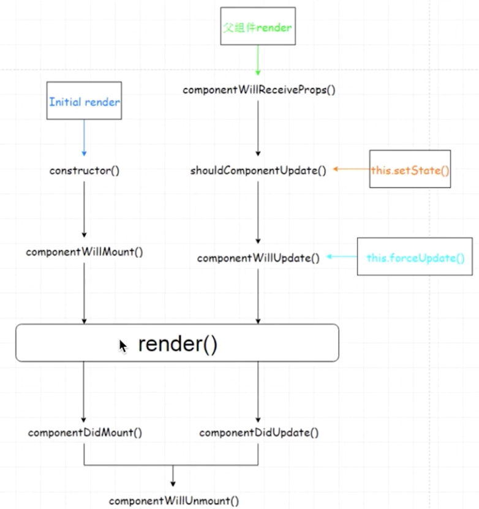

# CMS-web

基于React全家桶 + antd开发的一套共享单车后台管理系统。

## 官方脚手架 create-react-app

[create-react-app](https://reactjs.org/docs/create-a-new-react-app.html)

## npm vs yarn

Yarn是新一代包管理工具，修复了npm的一些缺陷。
它速度快、安装版本统一、更安全、更简洁的输出、更好的语义化。
yarn init初始化项目。
yarn add xxx 添加包
yarn remove xxx 删除包
yarn/yarn install 安装项目里所有依赖包

## React生命周期 （钩子函数）

- getDefaultProps
- getInitialState
- componentWillMount
- render
- componentDidMount
- componentWillReceiveProps
- shouldComponentUpdate
- componentWillUpdate
- componentDidUpdate
- componentWillUnmount



### 引入less支持、antd

```console
// less
yarn eject    // 暴露配置文件
yarn add less-loader less
修改配置文件，webpack.config.dev.js 和 webpack.config.prod.js，告诉webpack如何编辑、加载、解析less文件。（less-loader ->  postcss -> css-loader -> style-loader）
// antd
yarn add antd
// 按需加载css
yarn add babel-plugin-import
```

tips：

- 通过babel-plugin-import插件，按需加载指定的css，可以减少样式数量，提高生产环境性能。
- 配置less-loader,可以修改less变量，达到定制主题的效果。
- less版本降级为 2.7.3， 修复未知bug。（less 3以上版本配置改动比较大）

### 页面结构开发

组件 components/
主页 admin.js
